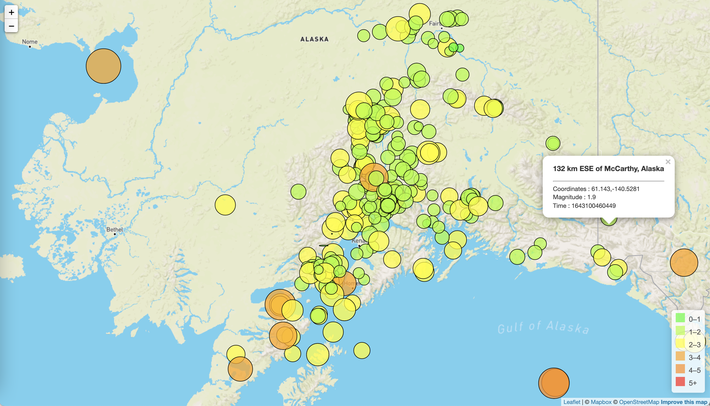

# **Visualising Data using Leaflet**

**Level 1: Basic Visualisation**

 

The first task was to create a basic visualisation by using the geojson dataset of "All the earthquakes from the past 7 days" on the <a href="https://earthquake.usgs.gov/earthquakes/feed/v1.0/geojson.php" >USGS GeoJSON Feed Page.</a>

 

Created a map using Leaflet that plots all of the earthquakes from the dataset based on their longitude and latitude.

* The data markers reflect the magnitude of the earthquake in their size and colour. Earthquakes with higher magnitudes should appear larger and darker in colour.

* Include popups that provide additional information about the earthquake when a marker is clicked.

* Create a legend that will provide context for your map data.

 

The final visualisation is presented below

 

